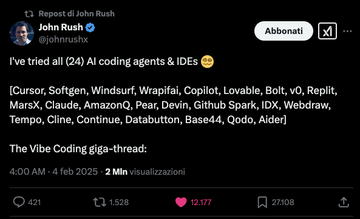

Wow, time for some little automation ;)
**TIL** [ adding week number from bash](https://stackoverflow.com/questions/70226713/how-do-i-get-next-week-number-in-bash) (or as we call it *stackoverflowing*).

https://stackoverflow.com/questions/70226713/how-do-i-get-next-week-number-in-bash

## Genius from Twitter tried 24 IDEs for us

* John rush tried 24 IDEs for us: @SoftgenAI, Cursor, Wrapifai, Windsurf, and 20 more! VEry nice and cool small videos attached.

* https://x.com/johnrushx/status/1773384063463616643

<!--  links from whatsapp

-->
